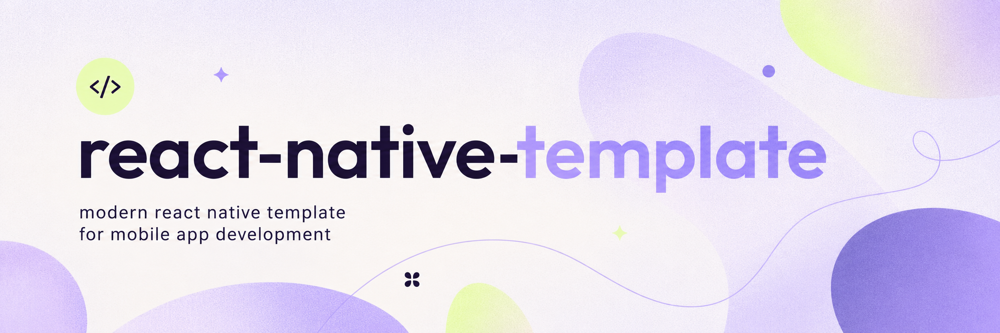

# 📱 React Native Template


An opinionated production starter for React Native apps — strict TypeScript,
Redux Toolkit, stack navigation, MMKV-backed persistence, Unistyles theme
tokens, i18n, shared UI primitives, and small app-facing adapters around native
capabilities.

It ships an `AGENTS.md` / `CLAUDE.md` pair and a bundled set of `SKILL.md` files,
so coding agents get the project's conventions and review procedures the moment
you generate an app. Pair it with the [💖 Companion skills](#-companion-skills)
for the full library.

```sh
npx @react-native-community/cli@latest init MyApp \
  --template https://github.com/ltatarev/react-native-template.git
```

## ⚡ Usage

Make sure your machine is ready for React Native development, then create a new
app from the template:

```sh
npx @react-native-community/cli@latest init MyApp --template https://github.com/ltatarev/react-native-template.git
```

Replace `MyApp` with your app name. If `npx` asks to install
`@react-native-community/cli`, confirm with `y`.

Do not use `npx react-native init`; React Native now treats that command as
deprecated and exits before creating the app.

Current template runtime:

- React Native `0.86.0`
- React `19.2.7`
- Node.js `>=22.11.0`
- Yarn `4.17.0`
- Ruby `2.7.7`
- CMake for iOS/Hermes pods

## 🛠️ Setup

From a generated app or the `template/` directory in this repository:

```sh
corepack enable
yarn
bundle install
yarn install-pods
```

Run the app:

```sh
yarn start
yarn ios
yarn android
```

## 📜 Scripts

| Script              | Purpose                                       |
| ------------------- | --------------------------------------------- |
| `yarn lint`         | Run ESLint flat config.                       |
| `yarn tsc`          | Run strict TypeScript without emitting files. |
| `yarn test:unit`    | Run the unit Jest harness.                    |
| `yarn madge`        | Check circular dependencies.                  |
| `yarn madge:image`  | Generate a dependency graph image.            |
| `yarn sanity`       | Run lint, TypeScript, and Madge checks.       |
| `yarn install-pods` | Install iOS Pods through Bundler.             |

## 🏗️ Architecture

```text
src/
├── common/            # Pure shared hooks, types, helpers
├── modules/
│   ├── design-system/ # Primitive gallery (development only)
│   ├── feature-flag/  # Typed boolean gates
│   ├── home/          # Neutral reference feature
│   ├── main/          # App shell and root navigator
│   ├── navigation/    # Route helpers, screen options, navigation ref
│   ├── onboarding/    # First-run gate
│   ├── redux/         # Store, persistor, typed hooks
│   └── settings/      # Appearance and about
├── theme/
│   ├── redux/     # Persisted appearance mode
│   ├── ui/        # Shared UI primitives
│   ├── gutter.ts  # Device metrics
│   ├── scales.ts  # Spacing, radii, type, motion, size, z-index
│   ├── styles.ts
│   ├── theme.ts   # The two palettes
│   ├── types.ts
│   └── unistyles.ts
└── utils/
    ├── app-state/
    ├── error-handling/
    ├── haptic-feedback/
    ├── logger/
    ├── services/
    ├── storage/
    └── toast.tsx

i18n/
├── en_EN.json
├── index.ts
└── resources.ts
```

The codebase is package-by-feature. Feature modules live under
`src/modules/<feature>` and expose their public API through
`src/modules/<feature>/index.ts`.

Cross-module imports should use the public module surface:

```ts
import { HomeScreen } from 'modules/home';
```

Do not reach into another module's internals:

```ts
import { HomeScreen } from 'modules/home/screens/HomeScreen';
```

ESLint enforces this with `no-restricted-imports`.

## 🧭 Aliases

Aliases are configured in both TypeScript and Babel.

| Alias       | Resolves to     |
| ----------- | --------------- |
| `assets/*`  | `src/assets/*`  |
| `common/*`  | `src/common/*`  |
| `modules/*` | `src/modules/*` |
| `theme/*`   | `src/theme/*`   |
| `utils/*`   | `src/utils/*`   |

## 🎨 Styling

Styling uses `react-native-unistyles`.

- Import `StyleSheet` from `react-native-unistyles`.
- Keep shared primitives in `src/theme/ui`.
- Use tokens from `theme.ts` (the two palettes) and `scales.ts` (gutter,
  typography, radii, motion, size, shadow, z-index).
- Avoid color literals in feature UI.
- Appearance is `system` / `light` / `dark`, persisted in `theme/redux` and
  pushed into Unistyles by `useAppearanceSync`.

Example:

```ts
const styles = StyleSheet.create(theme => ({
  title: {
    color: theme.colors.text,
    fontSize: theme.typography.fontSize.lg,
    marginBottom: theme.gutter.md,
  },
}));
```

## 🗃️ State And Persistence

- Root store setup lives in `src/modules/redux`.
- Use `useAppDispatch` and `useAppSelector` from `modules/redux`.
- Feature state uses Redux Toolkit slices and selectors.
- Redux persistence uses MMKV through `utils/storage`.

## 🌍 Internationalization

i18n is initialized from `src/index.ts`.

- Resources live in `i18n/en_EN.json`.
- Components use `useTranslation()` from `react-i18next`.
- User-facing feature text should render through `t(...)`.

## 🔌 Adapters

Feature code should not import native SDKs directly. Use the app-facing
adapters in `src/utils`:

- `utils/storage` — Redux Persist storage, plus `appPreferences` for values read
  before the first frame
- `utils/toast`
- `utils/logger`
- `utils/error-handling`
- `utils/haptic-feedback`
- `utils/app-state` — foreground/background transitions
- `utils/services` — platform checks, app version

`docs/growing-the-app.md` describes the shape each of the common next
capabilities takes — bottom tabs, native sheets, notifications, SQLite, image
picking, widgets, subscriptions — none of which the template installs.

## 🧱 UI primitives

`theme/ui` ships the set every app re-derives otherwise:

`Screen`, `Text`, `View`, `Row`, `Touchable`, `Button`, `IconButton`, `Icon`,
`Card`, `Divider`, `Pill`, `SectionHeader`, `EmptyState`, `Skeleton`,
`ProgressBar`, `Switch`, `TextInput`, `Sheet`, `ConfirmDialog`, `LoadingScreen`,
`StatusBar`, `KeyboardAwareScrollView`, plus the toast viewport.

`modules/design-system`'s gallery screen renders all of them in the live theme —
add a new primitive there, and review both themes in one pass. Motion presets
(`usePressScale`, `useModalPresence`) come from `theme/ui/motion.ts` and every
animation honors Reduce Motion.

## ➕ Adding A Module

1. Create `src/modules/<name>/const.ts` with `MODULE_NAME` and route names built
   from `RouteService.constructRouteName`.
2. Create `src/modules/<name>/index.ts` as the public surface.
3. Add screens under `screens/`, built from `theme/ui` primitives.
4. Add Redux slice/selectors under `redux/` if the module owns state.
5. Register the reducer in `modules/redux/store.ts` when needed.
6. Register routes in `modules/main/navigator.tsx`.
7. Add text keys to `i18n/en_EN.json`.
8. Export only the API other modules need from the module barrel.

A route name two modules both need goes in `modules/navigation/routes.ts`, which
depends on nothing — that is what keeps sibling features from importing each other
just to navigate.

## 🤖 Agent context

Template-specific guidance ships inside the project so agents pick it up from a
generated app's root:

- `template/AGENTS.md` / `template/CLAUDE.md` — conventions, anti-patterns, commands
- `template/CONTEXT.md` — vocabulary and module boundaries
- `template/docs/growing-the-app.md` — the shape each common next capability takes
- `template/.agents/skills/` and `template/.claude/` — bundled review and
  scaffolding skills (e.g. `code-score`, `domain-modeling`, `gitmoji`)

See [💖 Companion skills](#-companion-skills) for the full, subscribable library.

## 💖 Companion skills

[`ltatarev/skills`](https://github.com/ltatarev/skills) — the **adora** plugin —
is a Claude Code marketplace of agent skills that encode this template's
conventions: building UI, scaffolding feature modules, writing tests, validating
changes, iOS widgets, launch screens, plus a commit and ticket workflow set.
Paired with this template they need no configuration — the module anatomy, the
`theme/ui` kit, and the Jest unit harness they target are all already here.

Install the whole bundle in Claude Code:

```bash
/plugin marketplace add ltatarev/skills
/plugin install adora@adora-skills
```

Skills then resolve as `/adora:<skill-name>`. Update with
`/plugin marketplace update adora-skills`.

Prefer to pick individual skills into a project (also works with other
Agent-Skills-standard harnesses)? Use the `skills.sh` installer instead:

```bash
npx skills@latest add ltatarev/skills
```

## 💀 License

MIT © [ltatarev](https://github.com/ltatarev)
